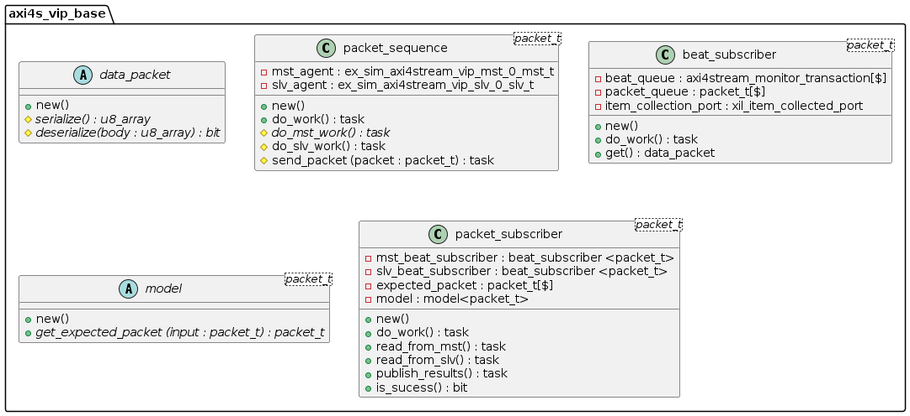

<div align="center">
  <a href="https://accelr.lk/">
    
  </a>

  <h1 align="center">AXI4S_VIP</h1>

  <p align="center">
   Accelr VIP project based on AXI4-Stream
    <br />
  </p>
</div>
</p>

## Content
- [Content](#content)
- [About the project](#about-the-project)
  - [Class diagram](#class-diagram)
  - [Imporant directory with files](#imporant-directory-with-files)
- [Getting started](#getting-started)
- [Example design](#example-design)

## About the project

Our latest creation, a Verification IP (VIP) for a Device Under Test (DUT) that incorporates AXI4-Stream master and slave ports.The purpose of this VIP is to facilitate the verification process of DUTs that utilize the AXI4-Stream protocol. By integrating our VIP, design and verification engineers gain the ability to customize packets that adhere to the AXI4-Stream protocol, enabling comprehensive testing of their designs.

We have developed a packet-level Verification IP (VIP) using the Xilinx AXI4-Stream VIP at the beat level. This VIP allows us to thoroughly verify any Device Under Test (DUT) by customizing and analyzing AXI4-Stream packets
### Class diagram


### Imporant directory with files
```
  ../axis_vip_base/
      ├── axi4s_vip_base.sv
      ├── beat_subscriber.svh
      ├── data_packet.svh
      ├── model.svh
      ├── packet_sequence.svh
      └── packet_subscriber.svh
```

## Getting started

This is an example of how you may give instructions on setting up your project. This example will demonstrates how to add verification for an axi4 stream fifo -i.e. fifo with an axi4 stream slave and a master ports.

1. Download or clone AXI4S_VIP project
  ```
    git clone git@github.com:accelr-net/axis_fifo_unit_test.git
  ``` 
2. Copy _axi4s_vip_base_ directory to your project
3. Add _axi4s_vip_base.sv_ file to __add or create design sources__ your Xilinx Vivado simulator
4. Extend your project files from our base classes (You only have to extend ```data_packet, packet_sequence, model```).
5. Import the _axi4s_vip_base_ package in your test top / top level module.
  ```
    import axi4s_vip_base::*;
  ```
1. Declare ```<your_module>_packet_sequence, <your_module>_beat_subscriber, <your_module>_beat_subscriber, <your_module>_packet_subscriber, <your_module>_model``` in your top module
  ```SystemVerilog
    <your_module>_model                                    model;
    <your_module>_packet_sequence                          <your_module>_sequence;
    <your_module>_beat_subscriber                          <your_module>_beat_subscriber_for_mst;
    <your_module>_beat_subscriber                          <your_module>_beat_subscriber_for_slv;
    <your_module>_packet_subscriber                        <your_module>_subscriber_for_packet;
    
  ```
7. Initialize above objects in a initial block in your top module
  ```SystemVerilog
    model                                  = new();
    <your_module>_sequence                 = new(mst_agent,slv_agent);
    <your_module>_beat_subscriber_for_mst  = new(mst_agent.monitor.item_collected_port);
    <your_module>_beat_subscriber_for_slv  = new(slv_agent.monitor.item_collected_port);
    <your_module>_subscriber_for_packet    = new(<your_module>_beat_subscriber_for_slv,<your_module>_beat_subscriber_for_mst,model);
  ```
8. fork ```do_work()``` of the objects ```<your_module>_sequence, <your_module>_beat_subscriber_for_mst, <your_module>_beat_subscriber_for_slv, <your_module>_subscriber_for_packet``` like below
  ```
    fork
      begin
          <your_module>_sequence.do_work();
          #<time_delay>;
      end
      begin
          <your_module>_subscriber_for_packet.do_work();
      end
      begin
          <your_module>_beat_subscriber_for_mst.do_work();
          
      end
      begin
          <your_module>_beat_subscriber_for_slv.do_work();
      end
    join_any
  ```


## Example design

This is an example of how you may give instructions on setting up your project. This example will demonstrates how to add the verification components for an axi4 stream fifo. (Refer ```../fifo_vip/ ``` directory)

1. Download or clone AXI4S_VIP project
  ```
    git clone git@github.com:accelr-net/axis_fifo_unit_test.git
  ``` 
1. Copy _axi4s_vip_base_ directory to your project
2. Add _axi4s_vip_base.sv_ file to __add or create design sources__ your Xilinx Vivado simulator
3. Extend your project files with our base classes (You only have to extend ```data_packet, packet_sequence, model```).
4. Import _axi4s_vip_base_ in your top level model module
  ```
    import axi4s_vip_base::*;
  ```
1. Declare ```fifo_packet_sequence, fifo_beat_subscriber, fifo_beat_subscriber, fifo_packet_subscriber, fifo_model``` in your top module
  ```SystemVerilog
    fifo_model                                    model;
    fifo_packet_sequence                          fifo_sequence;
    fifo_beat_subscriber                          fifo_beat_subscriber_for_mst;
    fifo_beat_subscriber                          fifo_beat_subscriber_for_slv;
    fifo_packet_subscriber                        fifo_subscriber_for_packet;
    
  ```
7. Initialize above objects in a initial block in your top module
  ```SystemVerilog
    fifo_model                    = new();
    fifo_sequence                 = new(mst_agent,slv_agent);
    fifo_beat_subscriber_for_mst  = new(mst_agent.monitor.item_collected_port);
    fifo_beat_subscriber_for_slv  = new(slv_agent.monitor.item_collected_port);
    fifo_subscriber_for_packet    = new(fifo_beat_subscriber_for_slv, fifo_beat_subscriber_for_mst, fifo_model);
  ```
8. fork ```do_work()``` of the objects ```fifo_sequence, fifo_beat_subscriber_for_mst, fifo_beat_subscriber_for_slv, fifo_subscriber_for_packet``` like below
  ```
    fork
      begin
          fifo_sequence.do_work();
          #1000;
      end
      begin
          fifo_subscriber_for_packet.do_work();
      end
      begin
          fifo_beat_subscriber_for_mst.do_work();
          
      end
      begin
          fifo_beat_subscriber_for_slv.do_work();
      end
    join_any
  ```


1. Added fifo classes </br>
  </br>
  
  _fifo_packet_
  ```SystemVerilog
    class fifo_packet extends data_packet;
      function u8_array serialize();
        //serialize a packet
      endfunction

      function bit deserialize(u8_array another_packet);
        //deserialize a packet
      endfunction

      function bit do_compare(data_packet second_packet);
        //add logic to compare 2 packets (equal or not)
      endfunction
    end 
  ```
  _fifo_packet_sequence_
  ```SystemVerilog
    class fifo_packet_sequence extends packet_sequence #(fifo_packet);
      //give master and slave agents in the constructor
      function new(
        ref mst_agent,
        ref slv_agnet
      );
        super.new(mst_agent,slv_agent)
      endfunction

      //give your sequence at do_mst_work() task
      task do_mst_work();
        //sequence goes here
      endtask
    endclass
  ```
  _fifo_model_
  ```SysteVerilog
    class fifo_model extends model #(fifo_packet);
      //this gives a expected packet or packets with respect to a given packet
      function packet_t_queue get_expected_packet(fifo_packet input_packet);
        //make a model here
      endfunction
    endclass
  ```
---
> **_NOTE:_** This project is a work-in-progress. As such we value your feedback. If you come across any issues while using the source code in the project, please do reach out for help by creating a new issue via github.
---

